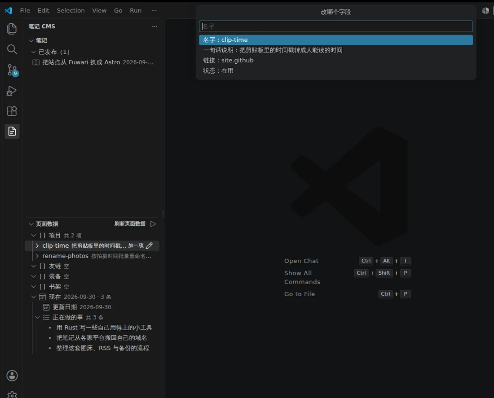

# 天音铃 · 个人页 + 博客

一个手写的极简 Astro 站点：个人页、笔记、归档、分类与标签、项目、现在、统计、友链、装备、书架，
一共 18 个静态页面，**0 个客户端 JavaScript、没有 webfont，CSS 合计 12 KB**，整站产物 276 KB。

线上：<https://hyw.mom>　RSS：<https://hyw.mom/rss.xml>

| 桌面 | 手机 |
| --- | --- |
|  |  |

## 为什么自己写

站点原先跑在 Fuwari（Astro 上的一套主题）上，好看但重：一堆客户端脚本、webfont、几百 KB 的 JS。
这里想反过来做，四条约束一路没破：

- **0 个客户端 JavaScript**——顶栏、图标、分页、目录、字数，全是构建时算好或者纯 CSS
- **不用 webfont**——标题用系统宋体、正文用系统黑体；中文站一个字库子集也是几百 KB，这笔省掉
- **样式一共两个文件**——全站共用 7.5 KB，个人页额外再加 4.6 KB（小样式表 Astro 会内联进 HTML）
- **只有黑白灰**——没有强调色、没有卡片阴影；家里唯一的实心块是那个黑底「GitHub」按钮

## 体积（`pnpm build` 之后实测）

| 项 | 大小 |
| --- | --- |
| 整站 `dist/` | 276 KB |
| HTML（18 个页面） | 90.9 KB |
| CSS（全站共用） | 7.5 KB |
| CSS（只有个人页要） | 4.6 KB |
| 头像 `avatar.webp` | 6.7 KB |
| 分享图 `og.png` | 29.6 KB |
| `favicon.svg` | 0.4 KB |
| **JavaScript 文件** | **0 个** |

首页上有 30 个外链 ``：技术栈徽章走 shields.io，两张数据卡走 github-readme-stats 和
streak-stats，底部波浪走 capsule-render。这些不在 `dist/` 里，但首屏要多发 30 个请求、也依赖
那几家服务还在；不想要就把 `src/site.config.ts` 里的 `stack` 和 `assets` 删掉。

## 快速开始

需要 Node 20+ 和 pnpm（本地 12、Cloudflare 上 10，两个都跑过）。

```bash
pnpm install
pnpm dev        # http://localhost:4321
pnpm build      # 输出到 dist/，纯静态
pnpm preview    # 预览构建结果
```

改站点信息不用碰页面代码，全在 `src/site.config.ts`。

## 目录结构

```
src/
├─ site.config.ts              站点信息 + 各页数据（名字、域名、项目、友链、装备、书架、现在…）
├─ content.config.ts           笔记的 frontmatter schema
├─ content/posts/              笔记本体，一个 .md 一篇
├─ layouts/Base.astro          全站骨架：顶栏、页脚、meta、RSS 链接
├─ components/                 Profile / Sidebar / PostList / Pager / Icon
├─ lib/posts.ts                读笔记：排序、分类计数、字数、相关文章、系列、统计
├─ lib/rehype-heading-ids.mjs  构建时给标题加 id 和锚点
├─ pages/                      一个文件一个路由
└─ styles/global.css           全站共用样式（个人页那点额外样式写在页面组件里）
tools/post-cms/                可选的 VS Code 扩展：「笔记」「页面数据」两个面板
docs/                          README 里那两张预览图
wrangler.jsonc                 Cloudflare Workers 静态资源部署配置
astro.config.mjs               site 地址、RSS、rehype 插件
```

## 写一篇笔记

在 `src/content/posts/` 里加一个 `.md`：

```yaml
---
title: 标题
description: 列表里显示的一句话
pubDate: 2026-09-27
category: 折腾          # 默认「日常」
tags: ['Astro', '建站']  # 默认空数组
draft: false            # true 就不发布，本地照常能看
series: 建站            # 可选：同系列的文章会自动串成一个列表
---
```

文件名就是 URL：`astro-rewrite.md` → `/posts/astro-rewrite/`（中文文件名也是合法 URL，会被编码）。

文章页上这几个东西都是构建时算出来的，页面不跑脚本：

- **字数 / 阅读时间**：汉字按字、英文按词，代码块和链接地址不算，再按 350 字/分钟估
- **右侧目录**：拿 Astro `render()` 给的 `headings` 生成，宽度不够就收起来
- **标题锚点**：`h2` / `h3` 后面那个 `#`，由 `src/lib/rehype-heading-ids.mjs` 挂上。它顺带做 id
  （Astro 自己那一步跑在用户插件之后，在插件里取不到 id），规则和 Astro 一致：小写、空格转连字符、
  去标点、重名加 `-1`。锚点写成空链接、`#` 由 CSS 伪元素画——因为 `render()` 的 `headings` 会读标题
  文本，塞个真 `#` 进去会把目录也弄脏
- **相关文章**：先按共享标签排，一个都不共享时退回同分类
- **系列**：写了 `series` 就自动串成列表，上下篇也在系列内走

> 改这个 rehype 插件之后记得删 `node_modules/.astro/`：内容渲染结果缓存在那儿，不清的话老文章的
> 正文不会重新渲染，插件看着就像没生效。另外它必须用**路径字符串**引用——内容层跑在单独的 worker 里，
> 配置里写成函数会被序列化掉、传不过去。

## 数据在哪改

`src/site.config.ts` 一个文件全包：

| 想改什么 | 改哪里 |
| --- | --- |
| 站点名、域名、GitHub 账号、每页几篇 | `name` / `url` / `github` / `perPage` |
| 首页 README 框的标题、副标题、链接行 | `handle` / `tagline` / `links` |
| 技术栈徽章（照 GitHub profile 那样分三行） | `stack`，每项是名字 + 底色 + logo |
| 两张数据卡、底部波浪 | `assets`，里面是完整外链，改 `theme` 就换配色 |
| 头像、左栏信息行、「正在做的事」 | `avatar` / `facts` / `doing` |
| 波浪图上面那句话 | `signoff` |
| 项目 / 友链 / 装备 / 书架 / 现在页的日期 | `projects` / `friends` / `gear` / `shelf` / `now.updated` |
| 颜色、字体、正文排版 | `src/styles/global.css` |

`friends` / `gear` / `shelf` 现在是空数组，对应页面显示空状态，填上就有内容。不想要哪一页，
把 `src/pages/` 下的目录删掉，再删 `Base.astro` 页脚里那个链接即可。

个人页上半部分是按 GitHub profile 的版面排的：标题 → 副标题 → 链接行 → 三行徽章 → 两张数据卡 →
底部波浪。框标题栏右边那个铅笔是照着 GitHub 画的装饰，点了不做任何事；想让它能真跳去编辑，
把 `Profile.astro` 里的 `span.rm-edit` 换成
`<a href="{site.github}/{site.repo}/edit/main/{site.readme}">` 就行。

## 页面清单

- `/` 个人页，往下滑就是笔记列表
- `/notes/` 全部笔记（超过 8 篇自动分页成 `/notes/2/`）
- `/categories/`、`/categories/<分类>/` 分类索引与分类下的笔记
- `/tags/`、`/tags/<标签>/` 标签索引与带该标签的笔记
- `/posts/<文件名>/` 文章页（字数、目录、锚点、相关、系列）
- `/archive/` 全部笔记按年月排开
- `/projects/` `/now/` `/about/` `/stats/` 项目、现在在做什么、关于、站点统计
- `/friends/` `/gear/` `/shelf/` 友链、装备、书架
- `/404.html` 找不到的地址
- `/robots.txt` `/og.png` 抓取规则与分享卡片图
- `/rss.xml` `/sitemap-index.xml`

## 滚动时钉住的三层

桌面宽度下有三层东西是钉住的：**顶栏**、**「笔记」那条标题条**（整幅宽，钉在顶栏下面）、
**左边整栏卡片**（钉在标题条下面，窗口太矮就改成在自己内部滚；窄屏单列布局下不钉）。

三层挂在同一根容器底线上，所以列表快到底时左栏一定会先被容器顶出去、从标题条底下滑过去。
「钉住的行程」= 正文列高 − 左栏高；「什么时候被顶出去」只跟网格下面还剩多少高度有关
（= 页脚高度 + 视口高度 − 容器底线），页脚留白收得紧就是为了把它推出视口外。

注意这块现在还用不上：站上只有一篇示例笔记，`/notes/` 整页 610px 高，在 1440×900 下根本滚不动
（实测左栏 228px 高、正文列 364px 高、网格宽 1032px）。等笔记多起来它才开始工作。

## 用 VS Code 写（可选）

仓库里带了个自用的小扩展 `tools/post-cms/`。装上以后左边活动栏多一个自己的图标，两个面板，
**点一下就是编辑**，不用先跳到文件里再手动改：

- **笔记**：草稿 / 已发布分组，新建文章、一键发布或转回草稿、打开本地预览；右键「改这篇的内容」
  就地改标题、摘要、分类、标签、系列、日期。只动 frontmatter、不碰正文
- **页面数据**：管 `src/site.config.ts` 里那几页（项目 / 友链 / 装备 / 书架 / 现在）。点条目弹出
  「改哪个字段」，点字段直接改那一个；加一项、删一项、想手动改就右键定位回配置文件



`.vsix` 是构建产物，没进仓库。从 [Releases](https://github.com/YoisakiKnd/Blog/releases) 下载后：

```bash
code --install-extension post-cms-0.3.0.vsix
# 或者 VS Code → 扩展面板右上角 … → 从 VSIX 安装
```

也可以自己打一个：`cd tools/post-cms && pnpm install --ignore-workspace && pnpm package`。
打 tag（`post-cms-v*`）会触发 [工作流](.github/workflows/extension-release.yml) 自动跑类型检查、
测试、打包并挂到 Release 上。

运行时零依赖；frontmatter 按行改、`site.config.ts` 按括号和字符串边界改，都只替换命中的那一段，
其余字节不动。细节和开发命令见 [`tools/post-cms/README.md`](tools/post-cms/README.md)。

## 部署

纯静态，丢哪都能跑（`dist/` 直接扔进任何静态托管）。线上走的是 **Cloudflare Workers**（不是 Pages）：
构建命令 `pnpm build`、部署命令 `npx wrangler deploy`、产物目录 `dist`、Node 20 以上。

两个坑记一下：

1. **`wrangler.jsonc` 里不能写 `main`。** 这是纯静态站，没有 Worker 脚本，配置只写
   `assets.directory = ./dist`。写了 `main` 或者用 `@astrojs/cloudflare` 适配器会去找
   `dist/_worker.js`，部署直接失败。本地可以 `npx wrangler deploy --dry-run` 验配置，
   它会打印读到了多少个资源文件。
2. **`pnpm-workspace.yaml` 不能删、也不能少 `packages:` 字段。** pnpm 10 只要看见这个文件就要求
   有 `packages`，缺了报 `ERROR packages field missing or empty`，构建挂在这步（Cloudflare 上是
   pnpm 10、本地是 12，表现不一样，本地不容易测出来）。同一个文件里 `allowBuilds`（pnpm 11/12 认）
   和 `onlyBuiltDependencies`（pnpm 10 认）都写着——两个版本叫法不同，写全了 esbuild 的安装脚本
   才不会被拦。

## 拿去改成自己的

- `astro.config.mjs` 里的 `site` 换成自己的域名（影响 RSS、sitemap、canonical）
- `src/site.config.ts` 里的站名、域名、GitHub 账号（现在是 `YoisakiKnd`，首页三处外链都跟着它走）
- `src/content/posts/` 里那篇示例文章，直接删掉换成自己的
- `public/avatar.webp`（现在是 256×256 的 WebP，6.7 KB）和 `public/og.png`（1200×630 分享图）
- 首页的数据卡是外链图，`assets` 里那几个地址带的用户名也要改；这些图随对方服务实时更新，
  服务挂了就是空白，所以 `alt` 里都写了说明

关于头像那点小事：站点用的是 Gravatar，但 `gravatar.loli.net` 不认 `s` 参数——`?s=512`、
`?s=256`、`?s=128` 返回的都是同一张 512×512、198 KB 的图，一张头像比全站 CSS 加起来还大，
所以抓下来缩到 256×256 存成本地 WebP。想直连就改 `avatar` 那个字段。

## 许可

代码 MIT，见 [`LICENSE`](LICENSE)——随便拿去改、拿去用。

`src/content/posts/` 里的文章是作者自己写的，版权归作者本人，转载前先说一声。

首页那些图来自第三方服务，用到了就顺手谢一下：shields.io（技术栈徽章）、
github-readme-stats 与 streak-stats（数据卡）、capsule-render（波浪）。站点本身从
[Fuwari](https://github.com/saicaca/fuwari) 迁过来，构建则全靠 [Astro](https://astro.build)。